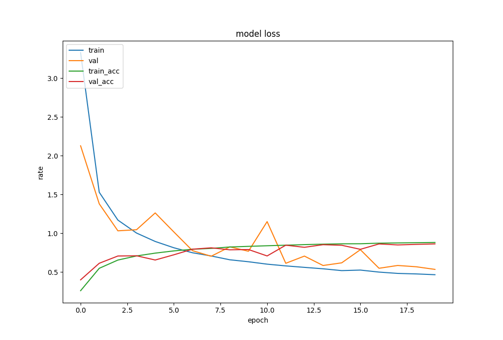

# slowfast-keras
Keras-Tensorflow implementation of [SlowFast](https://arxiv.org/pdf/1812.03982) for Gesture Detection


## Prerequisites
* tensorflow (2.x)
* opencv-python
* matplotlib
* tqdm

## Dataset Preparation
I used [20bn-jester v1 dataset](https://20bn.com/datasets/jester) for gesture training. Download dataset from [Kaggle](https://www.kaggle.com/toxicmender/20bn-jester/version/1) and decompress it in somewhere. Note that the dataset downloaded from Kaggle is not full Jester dataset. For the complete dataset, visit the [20bn's official website](https://20bn.com/datasets/jester).

After decompression is done, run
```
$ python prepare.py path_where_jester_dataset_is
```
before training.

## Data Augmentation
For data augmentation, DataGenerator class is implemented in [datagenerator.py]('./datagenerator.py')

DataGenerator randomly pick 16 image sequence from 37 original samples and change rotation angle(-10 ~ 10 deg).
Each image is resized to 112x112 and convert colorspace from RGB to GRAY. Thus, the output shape is 16 x 112 x 112 x 1 (16 images x 112 px x 112 px x 1).

## Training
Model is defined in [network.py](./network.py).

Pretrained model is available from [here](https://drive.google.com/file/d/1Mdq0yf6LaZ4PKJPV4xjI3dI_F1uvnQ21/view?usp=sharing). Click download link and save weights.h5 file in [model](./model) folder. You can skip this phase if you want to check live webcam application first.

To train this model, run
```
$ python train.py
```
Following parameters are defined by default
* batch_size: 16
* Adam optimizer with amsgrad
* Learning rate: 2e-3 for 20 iter, 1e-4 for 10 iter

Training result is look like this:

This model achived 90.8% accuracy after traning.

Unfortunately, after model.fit is finished, memory was not cleared properly so that when model.fit called 2nd times, system raises 'memory not enough error' and terminated forcibly in CoLab free tier environment.

Thus, to train with dynamic learning rate by iterations, you need to run train.py multiple times. _If you know how to cleanup the memory properly after model.fit, please let me know!_

After training is done, model will be saved under _model/network.h5_.

## Application
To test with live webcam application, run
```
$ python app.py
```
